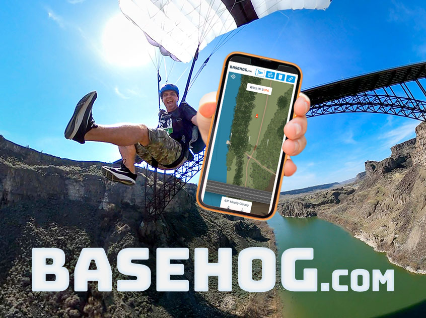

# Promineo Final Project

For my final project in the Promineo FE Bootcamp, I decided to get started on some real-world application. In my other life, I'm a BASE Jump Instructor. A very big part of safe parachuting is weather evaluation--specifically winds. My new website will provide BASE jumpers with wind readings that will help them plan and visualize a landing pattern. It also provides a list of parachute packing steps to assist in learning, as well as a page of helpful links. Currently, this website is specific to the Perrine Bridge in Twin Falls, Idaho, but this is a concept that could eventually be expanded to any BASE site or skydiving dropzone.

### Assignment Instructions

- Use React Router and have at least 3 pages using React Bootstrap or an alternative styling library
- Contain at least 10 components
- Allow for all CRUD operations
